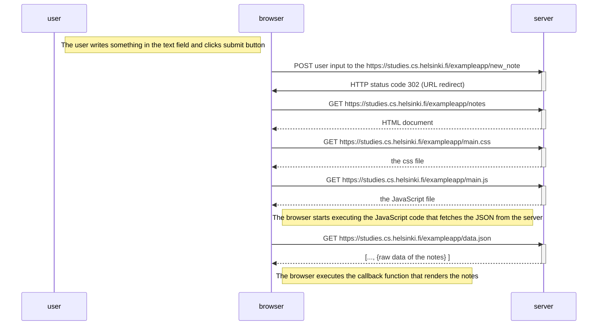

```mermaid
sequenceDiagram
    participant user
    participant browser
    participant server
    

    Note right of user: The user writes something in the text field and clicks submit button
    
    browser->>server: POST user input to the https://studies.cs.helsinki.fi/exampleapp/new_note
    activate server
    server->>browser: HTTP status code 302 (URL redirect)
    deactivate server

    browser->>server: GET https://studies.cs.helsinki.fi/exampleapp/notes
    activate server
    server-->>browser: HTML document
    deactivate server

    browser->>server: GET https://studies.cs.helsinki.fi/exampleapp/main.css
    activate server
    server-->>browser: the css file
    deactivate server

    browser->>server: GET https://studies.cs.helsinki.fi/exampleapp/main.js
    activate server
    server-->>browser: the JavaScript file
    deactivate server
    Note right of browser: The browser starts executing the JavaScript code that fetches the JSON from the server

    browser->>server: GET https://studies.cs.helsinki.fi/exampleapp/data.json
    activate server
    server-->>browser: [..., {raw data of the notes} ]
    deactivate server

    Note right of browser: The browser executes the callback function that renders the notes
```