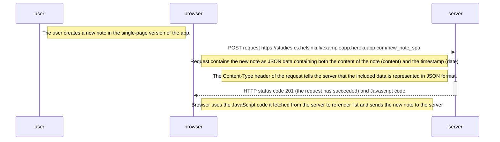

```mermaid
sequenceDiagram
    participant user
    participant browser
    participant server
    

    Note right of user: The user creates a new note in the single-page version of the app.
    
    browser->>server: POST  request https://studies.cs.helsinki.fi/exampleapp.herokuapp.com/new_note_spa
    Note right of browser: Request contains the new note as JSON data containing both the content of the note (content) and the timestamp (date)
    Note left of server: The Content-Type header of the request tells the server that the included data is represented in JSON format.


    activate server
    server-->>browser: HTTP status code 201 (the request has succeeded) and Javascript code
    deactivate server

    Note right of browser: Browser uses the JavaScript code it fetched from the server to rerender list and sends the new note to the server

```
